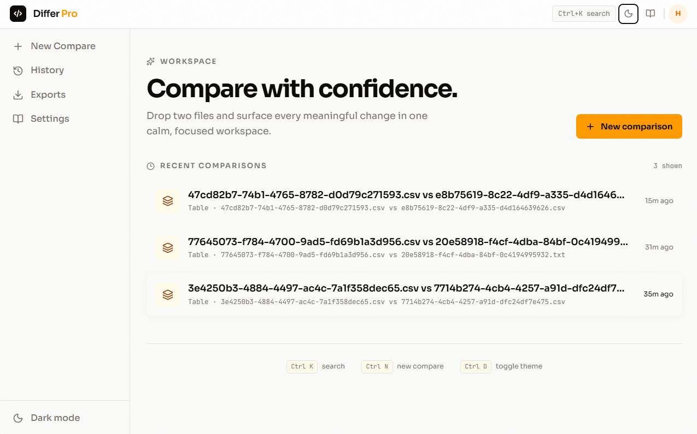
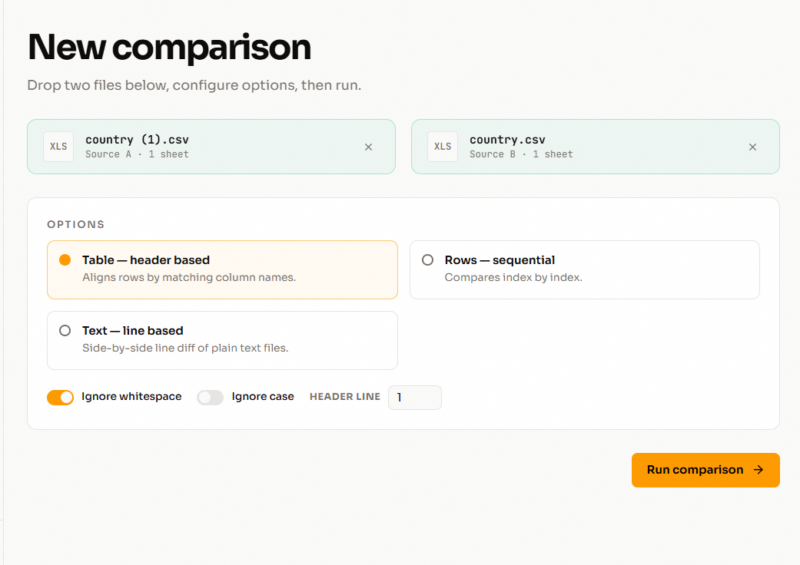
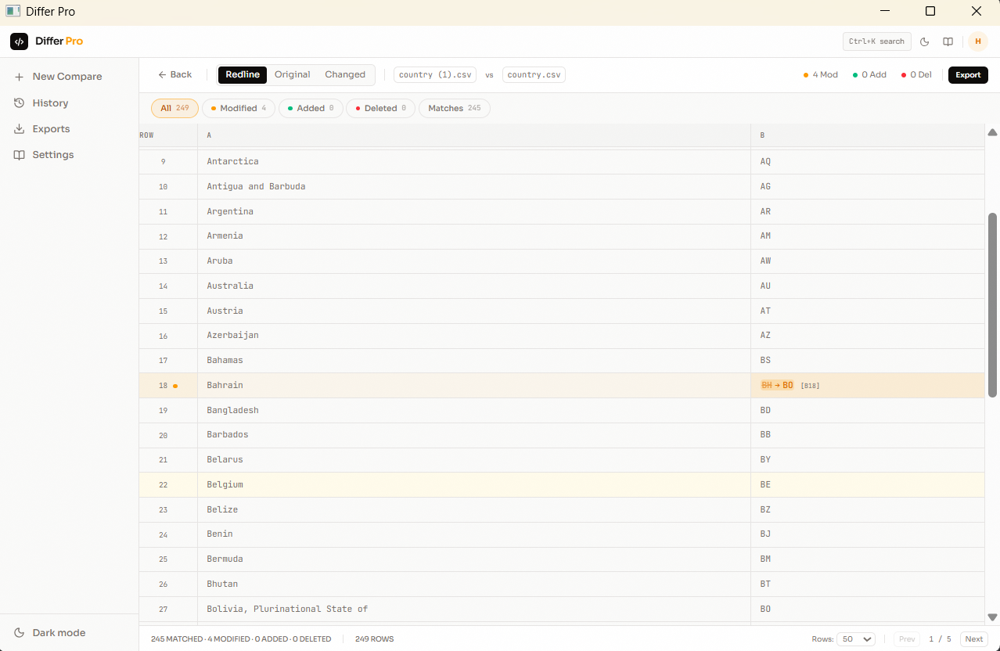
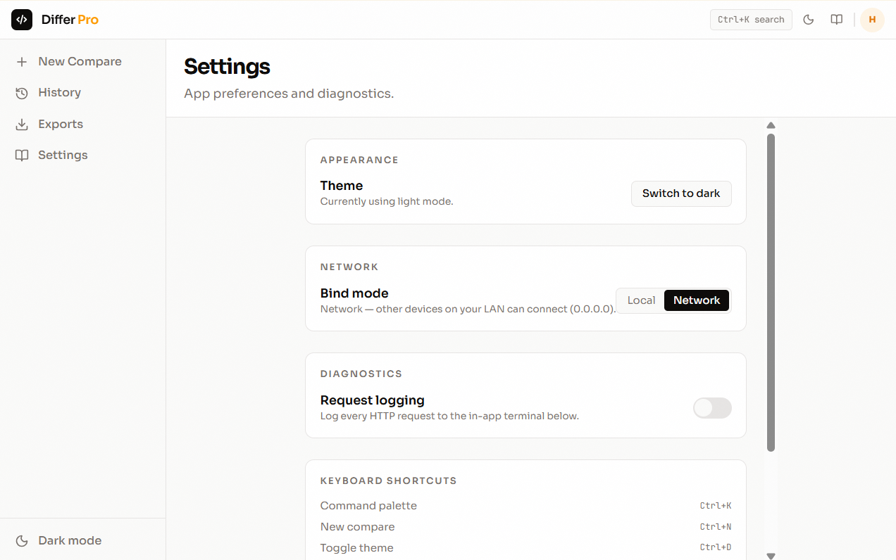

# Differ Pro

Local desktop app for comparing spreadsheet and text files side-by-side. Go backend + React SPA embedded in a native WebView2 window.

**Author:** Hareesh D



## Highlights

- **Spreadsheet diff** (CSV / TSV / XLSX / XLSM) — row-by-row, cell-level diffs with old → new values
- **Text diff** — side-by-side line diff using the Myers shortest-edit-script algorithm
- **Large-file friendly** — streaming, disk-backed comparison; files up to 4 GB are processed one row at a time, results go to SQLite, never fully in memory
- **Async jobs** — live progress, cancellation, and status
- **Comparison history** — every completed comparison is saved and can be reopened, renamed, or exported
- **Rich export** — CSV, JSONL, XLSX, and a styled HTML report (print-to-PDF)
- **Desktop shell** — persistent sidebar, keyboard-first command palette, theme toggle (light/dark)

## Screenshots

| Compare files | Diff results | Settings |
|---|---|---|
|  |  |  |

## Run

```sh
go run .
```

A WebView2 window titled **Differ Pro** opens at 1280x800. The local server binds to `127.0.0.1:8080`. Closing the window shuts the server down.

Flags:

| Flag | Description |
|---|---|
| `--local` | Bind to `127.0.0.1` (default) |
| `--network` | Bind to `0.0.0.0` (LAN access) |
| `--logs` | Log each HTTP request |

If WebView2 is unavailable, the app falls back to opening the default browser.

> The UI is embedded from `ui/dist` at compile time. After changing the frontend, run `npm run build` in `ui/` before rebuilding the Go binary (see [Build](#build)).

## Features

### Excel / CSV (large-file friendly)
- Compare CSV, TSV, TXT, XLSX, XLSM files
- **Streaming, disk-backed comparison** — files up to 4 GB processed one row at a time; results go to SQLite
- Asynchronous jobs with live progress and cancellation
- Cell-level diffs with old → new values
- Ignore white space / ignore case options
- Filter results: All, Matches, Non-matches, Modified, Added, Deleted
- Paginated results (never loads the whole diff into the browser)
- Export results as CSV or JSONL (matches or non-matches)

### Text
- Side-by-side line diff using the Myers algorithm (shortest edit script)
- Auto-detection of plain-text files; paste two texts and compare, or use a `.txt` file directly

### Desktop-app workspace
- App-style shell with persistent sidebar: **New Compare**, **History**, **Exports**
- **Comparison history** — every completed comparison is saved (SQLite at `data/differ.db`), survives restarts, and can be renamed, reopened, or exported
- **Custom-name export** — name your file before download; formats **CSV, JSONL, XLSX, PDF** (PDF prints a styled HTML report via the browser)
- **Exports log** — every generated export is recorded with its name and format

## API

| Endpoint | Method | Description |
|---|---|---|
| `/api/diff` | POST | Text diff `{original, changed}` |
| `/api/upload` | POST | Multipart file upload, returns `{id, path, name, size}` |
| `/api/sheets` | POST | List sheets `{path}` |
| `/api/jobs` | POST | Create comparison job `{originalPath, changedPath, options}` |
| `/api/jobs/{id}/status` | GET | Job status + summary + progress |
| `/api/jobs/{id}/rows` | GET | Paginated rows `?filter=&page=&pageSize=` |
| `/api/jobs/{id}/cancel` | POST | Cancel running job |
| `/api/jobs/{id}/export` | POST | Export `{name, filter, format}` (csv/jsonl/xlsx/pdf) |
| `/api/jobs/{id}/finalize` | POST | Persist completed job into history |
| `/api/jobs/{id}/report` | GET | Styled HTML report `?filter=` (for print-to-PDF) |
| `/api/history` | GET | List comparison history |
| `/api/history/{id}/name` | POST | Rename comparison `{name}` |
| `/api/history/{id}` | DELETE | Remove comparison from history |
| `/api/exports` | GET | List export history |
| `/api/exports/{id}` | DELETE | Remove export from history |

### Job options

```json
{
  "mode": "rows",
  "originalSheet": "Sheet1",
  "changedSheet": "Sheet1",
  "ignoreWhitespace": false,
  "ignoreCase": false,
  "hideUnchangedRows": false,
  "hideUnchangedColumns": false,
  "preserveFormatting": true
}
```

The `mode` option is one of `"rows"`, `"table"`, or `"text"`.

## Structure

```
main.go    HTTP server + API + WebView2 shell
embed.go   Embeds ui/dist SPA build into the binary
central/   Central SQLite store (history, exports)
diff/      Myers text diff
parse/     Streaming readers (CSV/TSV/TXT, XLSX/XLSM)
job/       Async comparison job engine + runner
store/     SQLite-backed result store (batched writes)
export/    Export writers (CSV, JSONL, XLSX, HTML report)
ui/        React + TypeScript SPA (Vite, builds to ui/dist)
```

## Build

```
npm run build          # in ui/ — builds SPA into ui/dist
go build -trimpath -ldflags "-H windowsgui" -o differ-pro.exe .
```

`-H windowsgui` builds a Windows GUI app — no console window. MinGW is required for CGO (WebView2). Build with:

```
$env:Path = "D:\Programs\MinGW\bin;" + $env:Path
$env:CGO_ENABLED = "1"
go build -trimpath -ldflags "-H windowsgui" -o differ-pro.exe .
```

> CI (`.github/workflows/build.yml`) builds a Windows binary on every push to `main` using `rsrc` for the icon, and uploads it as an artifact.

## Tests

```sh
go test ./...
```

Large files are handled by streaming readers (no `ReadAll`/`GetRows`) and batched SQLite transactions (5000-row batches).

## Format support

| Format | Streaming |
|---|---|
| CSV / TSV / TXT | ✅ |
| XLSX / XLSM | ✅ |
| XLS / XLSB / ODS | ❌ (not yet) |

## License

All rights reserved. No license is granted.
